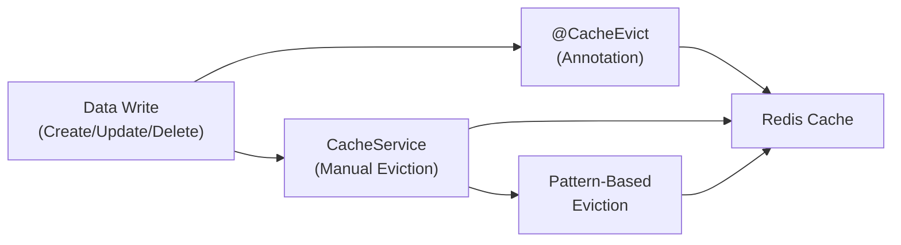

# 🔴 TinySlash — Redis Cloud Caching: Complete Analysis

> **Project:** TinySlash URL Shortener  
> **Generated:** February 10, 2026  
> **Scope:** All Redis/caching implementations across the entire backend

---

## 1. Architecture Overview

TinySlash uses **Spring Boot's `@EnableCaching` + Redis Cloud** as its primary caching layer, backed by **MongoDB** for persistent storage. The architecture has two modes:

| Mode | When Active | Implementation |
|------|-------------|----------------|
| **Redis Mode** | `spring.cache.type=redis` | `RedisConfig.java` — Full Redis Cloud with per-cache TTLs |
| **Simple (Fallback) Mode** | Redis not configured or unavailable | `CacheConfig.java` — In-memory `ConcurrentMapCacheManager` |

```mermaid
graph TB
    Client[Client Request] --> Controller
    Controller --> Service[Service Layer]
    Service -->|@Cacheable| Redis["Redis Cloud Cache"]
    Redis -->|Cache HIT| Service
    Service -->|Cache MISS| MongoDB[(MongoDB)]
    MongoDB --> Service
    Service -->|@CacheEvict| Redis
    Service -->|Manual Ops| CacheService["CacheService.java"]
    CacheService --> Redis
    AOP["CachePerformanceAspect"] -.->|Monitors| Service
    AOP -.->|Metrics| PerfMon["PerformanceMonitoringService"]
```

---

## 2. Redis Connection Configuration

### Environment Variables (`.env`)

| Variable | Default | Purpose |
|----------|---------|---------|
| `REDIS_HOST` | `localhost` | Redis server host |
| `REDIS_PORT` | `6379` | Redis server port |
| `REDIS_PASSWORD` | *(empty)* | Redis auth password |
| `REDIS_DATABASE` | `0` | Redis DB index |
| `REDIS_TIMEOUT` | `2000` | Connection timeout (ms) |
| `REDIS_MAX_ACTIVE` | `50` | Max active connections |
| `REDIS_MAX_IDLE` | `20` | Max idle connections |
| `REDIS_MIN_IDLE` | `5` | Min idle connections |
| `CACHE_TYPE` | `redis` | Cache type (`redis` or `simple`) |
| `CACHE_URL_TTL` | `3600` | URL cache TTL (seconds) |
| `CACHE_ANALYTICS_TTL` | `300` | Analytics cache TTL (seconds) |
| `CACHE_GEO_TTL` | `86400` | Geo-data cache TTL (seconds) |

### Serialization (RedisConfig.java)

- **Keys:** `StringRedisSerializer` (plain string keys)
- **Values:** `Jackson2JsonRedisSerializer` with `JavaTimeModule` and polymorphic typing
- **Key Prefix:** All manual operations use `pebly:` prefix

---

## 3. All 15 Named Cache Regions

Every named cache region, its TTL, what it stores, and which services use it:

| # | Cache Name | TTL | Data Cached | Service(s) | Caching Type |
|---|-----------|-----|-------------|------------|--------------|
| 1 | `short_urls` | **1 hour** (3600s) | URL lookup result by `shortCode:domain` | `UrlShorteningService` | **Read-Through** (`@Cacheable`) |
| 2 | `userUrls` | **10 min** (600s) | List of user's shortened URLs | `UrlShorteningService`, `DashboardService` | **Read-Through** (`@Cacheable`) |
| 3 | `userQRCodes` | **10 min** (600s) | List of user's QR codes | `QrCodeService`, `DashboardService` | **Read-Through** (`@Cacheable`) |
| 4 | `userFiles` | **10 min** (600s) | List of user's uploaded files | `FileUploadService`, `DashboardService` | **Read-Through** (`@Cacheable`) |
| 5 | `urlAnalytics` | **5 min** (300s) | Per-URL analytics (clicks, geo, device, referrer) | `AnalyticsService` | **Read-Through** (`@Cacheable`) |
| 6 | `userAnalytics` | **5 min** (300s) | Aggregated user analytics (all URLs combined) | `AnalyticsService` | **Read-Through** (`@Cacheable`) |
| 7 | `clickCounts` | **5 min** (300s) | Click count stats for a specific URL | `DashboardService` | **Read-Through** (`@Cacheable`) |
| 8 | `realtimeAnalytics` | **1 min** (60s) | Live/real-time click data for a user | `AnalyticsService` | **Read-Through** (`@Cacheable`) |
| 9 | `dashboardOverview` | **5 min** (300s) | Full user dashboard overview | `DashboardService` | **Read-Through** (`@Cacheable`) |
| 10 | `countryStats` | **1 hour** (3600s) | Geographic/country click statistics per user | `DashboardService` | **Read-Through** (`@Cacheable`) |
| 11 | `geoData` | **24 hours** (86400s) | Geographic data | *(config-defined only)* | **Read-Through** (`@Cacheable`) |
| 12 | `systemAnalytics` | **5 min** (300s) | System-wide analytics for admin dashboard | `AnalyticsService` | **Read-Through** (`@Cacheable`) |
| 13 | `adminDashboard` | **5 min** (300s) | Admin dashboard overview (metrics, activity) | `DashboardService` | **Read-Through** (`@Cacheable`) |
| 14 | `domains_list` | **1 hour** (3600s) | All domains owned by a user/team | `DomainService` | **Read-Through** (`@Cacheable`) |
| 15 | `verified_domains` | **1 hour** (3600s) | Only verified domains for link creation | `DomainService` | **Read-Through** (`@Cacheable`) |

---

## 4. Caching Strategies by Service

### 4.1 UrlShorteningService

| Method | Annotation | Cache | Key | What it Does |
|--------|-----------|-------|-----|-------------|
| `getByShortCodeAndDomainCached()` | `@Cacheable` | `short_urls` | `shortCode:domain` | **Core URL redirect lookup** — most performance-critical cache. Avoids DB hit on every redirect. |
| `getUserUrls()` | `@Cacheable` | `userUrls` | `userId` | Caches user's URL list for dashboard |
| `incrementClicks()` | `@CacheEvict` | `clickCounts`, `urlAnalytics`, `userAnalytics` | `shortCode` | Evicts analytics caches when click count changes |
| `createShortUrl()` | Manual | `userUrls` | `userId` | Manually evicts `userUrls` via `CacheService.clearCache()` |
| `updateUrl()` | Manual | `userUrls`, analytics | `userId`, `shortCode` | Manually evicts both user URLs and URL analytics |
| `deleteUrl()` | Manual | `userUrls`, analytics | `userId`, `shortCode` | Manually evicts caches on deletion |

**Caching Pattern:** **Cache-Aside / Read-Through** with explicit eviction on writes.  
**Fallback:** If cache lookup fails, falls back to `getByShortCodeAndDomainDirect()` (direct DB query).

---

### 4.2 AnalyticsService

| Method | Annotation | Cache | Key | What it Does |
|--------|-----------|-------|-----|-------------|
| `getUrlAnalytics()` | `@Cacheable` | `urlAnalytics` | `shortCode:userId` | Per-URL analytics dashboard data |
| `getUserAnalytics()` | `@Cacheable` | `userAnalytics` | `userId` | Aggregated analytics across all user's URLs |
| `getRealtimeAnalytics()` | `@Cacheable` | `realtimeAnalytics` | `userId` | Live click data (1-min TTL for near-realtime) |
| `getSystemAnalytics()` | `@Cacheable` | `systemAnalytics` | `'admin'` | Admin system-wide analytics |
| `recordClick()` | `@CacheEvict` | `urlAnalytics`, `userAnalytics`, `clickCounts`, `realtimeAnalytics` | `shortCode` | **Evicts all analytics caches when a click is recorded** |

**Eviction Strategy:** On every click, the `recordClick()` method evicts 4 cache regions and also calls `CacheService.invalidateUrlAnalytics()` for manual cleanup.

---

### 4.3 DashboardService

| Method | Annotation | Cache | Key |
|--------|-----------|-------|-----|
| `getAdminDashboardOverview()` | `@Cacheable` | `adminDashboard` | `'overview'` |
| `getDashboardOverview()` | `@Cacheable` | `dashboardOverview` | `userId` |
| `getUserUrls()` | `@Cacheable` | `userUrls` | `userId` |
| `getUserQRCodes()` | `@Cacheable` | `userQRCodes` | `userId` |
| `getUserFiles()` | `@Cacheable` | `userFiles` | `userId` |
| `getUrlClickCounts()` | `@Cacheable` | `clickCounts` | `shortCode` |
| `getCountryStats()` | `@Cacheable` | `countryStats` | `userId` |

**Pattern:** Heavy read-caching for dashboard. All 7 dashboard methods are cached to keep page loads fast.

---

### 4.4 QrCodeService

| Method | Annotation | Cache | Key |
|--------|-----------|-------|-----|
| `getUserQrCodes()` | `@Cacheable` | `userQRCodes` | `userId` |
| `createQrCode()` | Manual evict | `userQRCodes` | `userId` |
| `updateQrCode()` | Manual evict | `userQRCodes` | `userId` |
| `deleteQrCode()` | Manual evict | `userQRCodes` | `userId` |
| `recordScan()` | Manual evict | user analytics | `userId` |

**Pattern:** Cache-Aside with manual eviction via `CacheService.clearCache("userQRCodes", userId)`.

---

### 4.5 FileUploadService

| Method | Annotation | Cache | Key |
|--------|-----------|-------|-----|
| `getUserFiles()` | `@Cacheable` | `userFiles` | `userId` |
| `uploadFile()` | Manual evict | `userFiles` | `userId` |
| `updateFile()` | Manual evict | `userFiles` | `userId` |
| `deleteFile()` | Manual evict | `userFiles` | `userId` |
| `recordDownload()` | Manual evict | user analytics | `userId` |

**Pattern:** Same Cache-Aside pattern as QrCodeService.

---

### 4.6 DomainService

| Method | Annotation | Cache | Key |
|--------|-----------|-------|-----|
| `getDomainsByOwner()` | `@Cacheable` | `domains_list` | `ownerId:ownerType` |
| `getVerifiedDomains()` | `@Cacheable` | `verified_domains` | `ownerId:ownerType` |
| `clearDomainCache()` | `@CacheEvict` | `domains_list`, `verified_domains` | `ownerId:ownerType` |

**Additional Redis Usage (Direct `RedisTemplate`):**

| Feature | Redis Key Pattern | TTL | Purpose |
|---------|------------------|-----|---------|
| **Rate Limiting** | `domain:rate:{action}:{key}` | Configurable (e.g., 24h) | Limits domain additions to 20/day, verifications to 5/hour |
| **Domain Blacklist** | `domain:blacklist:{domainName}` | N/A | Blocks malicious/blacklisted domains |

---

## 5. Beyond Spring Cache: Direct Redis Usage

### 5.1 Rate Limiting (DomainService)

```java
// Rate limit: 20 domain adds per day per user
validateRateLimit(currentUserId, "domain_add", 20, 24 * 60 * 60);
// Rate limit: 5 verification attempts per hour per domain
validateRateLimit(domain.getDomainName(), "verification", 5, 60 * 60);
```

Uses `RedisTemplate.opsForValue().increment()` with `expire()` for sliding-window rate limiting.

### 5.2 Domain Blacklist Check (DomainService)

```java
String blacklistKey = DOMAIN_BLACKLIST_KEY + domainName;
Boolean isBlacklisted = (Boolean) redisTemplate.opsForValue().get(blacklistKey);
```

Checks Redis for domain safety before allowing domain reservation.

### 5.3 CacheService — Manual Operations

The `CacheService` provides programmatic cache management beyond annotations:

| Method | Purpose |
|--------|---------|
| `invalidateUserAnalytics(userId)` | Bulk-evicts 6 cache regions for a user |
| `invalidateUrlAnalytics(shortCode, userId)` | Evicts URL-specific + user analytics |
| `invalidateGeoStats()` | Pattern-based eviction: `countryStats*`, `geoData*` |
| `setCacheWithTtl(key, value, ttl)` | Manual cache entry with custom TTL |
| `getCacheEntry(key)` | Manual cache read |
| `cacheExists(key)` | Check if key exists in Redis |
| `incrementCounter(key)` | Atomic counter in Redis (`pebly:counter:*`) |
| `clearCachePattern(pattern)` | Wildcard key deletion (`pebly:*` prefix) |
| `logCacheStats()` | Logs cache breakdown by type |

### 5.4 Performance Monitoring (PerformanceMonitoringService)

Redis is used for **Micrometer metrics** and monitoring:

- **`cache.hits`** / **`cache.misses`** counters (tagged `type:redis`)
- **`cache.operation.duration`** timer
- **`cache.entries.active`** gauge — counts `pebly:*` keys in Redis
- Cache hit ratio calculation for health checks (threshold: >70%)

---

## 6. Cache Performance Aspect (AOP)

`CachePerformanceAspect.java` provides **automatic monitoring** for all Spring Cache annotations:

| Intercepted Annotation | What it Records |
|----------------------|-----------------|
| `@Cacheable` | Cache HIT/MISS, read operation duration |
| `@CacheEvict` | Eviction operations and duration |
| `@CachePut` | Put operations and duration |

Also monitors **database queries** in `repository.*` and `service.*` packages, logging slow queries (>500ms).

---

## 7. Cache Invalidation Strategy

The project uses a **multi-layer invalidation** approach:



| Trigger | Caches Invalidated | Method |
|---------|-------------------|--------|
| New URL created | `userUrls` | Manual (`CacheService`) |
| URL updated | `userUrls`, `urlAnalytics` | Manual (`CacheService`) |
| URL deleted | `userUrls`, `urlAnalytics` | Manual (`CacheService`) |
| Click recorded | `urlAnalytics`, `userAnalytics`, `clickCounts`, `realtimeAnalytics` | `@CacheEvict` + Manual |
| QR code created/updated/deleted | `userQRCodes` | Manual (`CacheService`) |
| QR code scanned | User analytics (6 caches) | Manual (`CacheService`) |
| File uploaded/updated/deleted | `userFiles` | Manual (`CacheService`) |
| File downloaded | User analytics (6 caches) | Manual (`CacheService`) |
| Domain verified/transferred | `domains_list`, `verified_domains` | `@CacheEvict` |
| Geo stats change | `countryStats*`, `geoData*` | Pattern-based eviction |

---

## 8. TTL Summary Table

| TTL Duration | Caches | Rationale |
|---|---|---|
| **1 minute** | `realtimeAnalytics` | Near-realtime dashboard data |
| **5 minutes** | `urlAnalytics`, `userAnalytics`, `clickCounts`, `dashboardOverview`, `systemAnalytics`, `adminDashboard` | Analytics can tolerate slight staleness |
| **10 minutes** | `userUrls`, `userQRCodes`, `userFiles` | User resource lists — moderate staleness OK |
| **1 hour** | `short_urls`, `countryStats`, `domains_list`, `verified_domains` | Slowly changing data |
| **24 hours** | `geoData` | Geographic lookups rarely change |

---

## 9. Fallback Behavior

When Redis is unavailable, the system gracefully degrades:

1. **`CacheConfig.java`** activates `ConcurrentMapCacheManager` (in-memory, no TTL)
2. **`RedisTemplate` operations** are guarded with `@Autowired(required = false)` — all manual Redis calls check `if (redisTemplate == null)` and skip operations
3. **Rate limiting** is bypassed when Redis is unavailable
4. **Domain blacklist** checks are skipped
5. **`RedisAutoConfiguration`** is excluded in `UrlShortenerSimpleApplication.java` for the minimal profile

---

## 10. Summary

| Metric | Count |
|--------|-------|
| **Named Cache Regions** | 15 |
| **`@Cacheable` Annotations** | 19 |
| **`@CacheEvict` Annotations** | 3 |
| **`@CachePut` Annotations** | 0 (monitoring aspect exists but unused) |
| **Manual Cache Operations** | 20+ (via `CacheService`) |
| **Direct `RedisTemplate` Usages** | 3 services (`CacheService`, `DomainService`, `PerformanceMonitoringService`) |
| **Caching Pattern** | Cache-Aside / Read-Through |
| **Invalidation Pattern** | Explicit eviction on writes (annotation + manual) |
| **Performance Monitoring** | AOP-based via `CachePerformanceAspect` |
| **Serialization** | JSON (Jackson2JsonRedisSerializer) |
| **Key Prefix** | `pebly:` |

> **Primary caching type: Cache-Aside (Read-Through) with explicit write-through eviction.** Every read operation is cached using `@Cacheable`, and every write operation explicitly invalidates affected caches using `@CacheEvict` annotations or manual `CacheService` calls. There is no write-through or write-behind caching — all data is written directly to MongoDB and the cache is invalidated.
